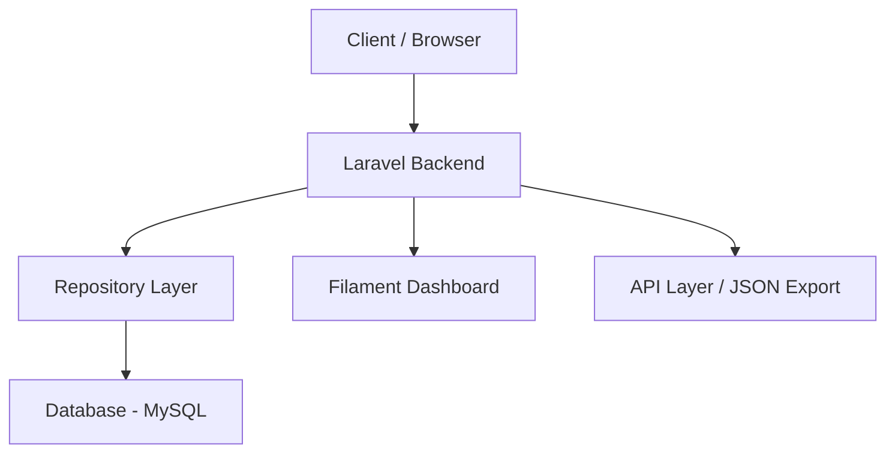

# 🛒 Merchant & Customer Account Management System

**نظام إدارة حسابات التجار والعملاء**

> مشروع مفتوح المصدر تم تطويره لحل مشكلة حقيقية تواجه آلاف التجار والعملاء في العالم العربي.  
> هدفه هو بناء شفافية وعدالة رقمية في التعاملات اليومية بين الطرفين.

---

## 💡 القصة وراء المشروع

بدأت الفكرة من تجربة واقعية:  
صاحب بقالة سجّل بالخطأ عليّ مبلغ **12,000 ريال** لمعاملة تخص شخصًا آخر.  
ومن هنا جاءت الفكرة:  
كم من الأخطاء تُرتكب يوميًا بسبب التسجيل اليدوي؟  
وكم من الخلافات تحدث لغياب النظام والشفافية؟

🎯 الحل: بناء **نظام رقمي متكامل** لإدارة حسابات التجار والعملاء، يمنع الأخطاء، ويحفظ الحقوق، ويُقدّم تجربة احترافية وسهلة.

---

## 🚀 الهدف من المشروع

-   تعزيز الشفافية بين التاجر والعميل
-   القضاء على الأخطاء اليدوية
-   إدارة محاسبية دقيقة وسهلة
-   تقارير مالية فورية وواضحة
-   نظام آمن يراعي خصوصية البيانات

---

## 🧩 المميزات الأساسية

### 🏪 إدارة التجار والمحلات

-   تسجيل بيانات التاجر بالكامل
-   دعم تعدد الفروع لكل تاجر
-   إدارة المنتجات بالأسعار والباركود والصور
-   تتبع الرصيد الإجمالي للتاجر

### 🧾 الطلبات والفواتير

-   تسجيل المشتريات بالتفصيل
-   ترقيم تلقائي للطلبات
-   حساب الإجماليات آليًا
-   دعم وحدات قياس متعددة

### 📊 نظام محاسبي مدمج

-   قيود محاسبية تلقائية (Debit/Credit)
-   كشف حساب فوري لكل عميل
-   ربط المعاملات بطلباتها أو دفعاتها
-   سجل زمني تفصيلي لكل عملية

### 🚨 تنبيهات مالية ذكية

-   تحذير عند تجاوز الحد الائتماني
-   تنبيه عند اقتراب الدين من الراتب
-   نسبة الدين محسوبة تلقائيًا
-   إشعارات فورية في لوحة التحكم

### 💳 المدفوعات والحسابات البنكية

-   دعم الدفع النقدي والتحويل والبطاقات
-   ربط كل دفعة بحساب بنكي محدد
-   تحديث الأرصدة بشكل لحظي

### 📤 التقارير والتصدير

-   تصدير Excel و JSON
-   توقيع رقمي للبيانات (Data Signature)
-   تقارير جاهزة للتحليل المالي

### 🔐 الأمان والصلاحيات

-   نظام صلاحيات متقدم (Roles & Permissions)
-   تشفير البيانات الحساسة
-   سجل تدقيق (Audit Trail)
-   حماية من الحذف العرضي

---

## ⚙️ التقنيات المستخدمة

| التقنية                | الاستخدام                 |
| ---------------------- | ------------------------- |
| **Laravel 12**         | الإطار الأساسي            |
| **Filament 4.x**       | لوحة التحكم               |
| **Livewire**           | التفاعلية اللحظية         |
| **Tailwind CSS**       | تصميم واجهات عصرية        |
| **MySQL**              | قاعدة البيانات            |
| **Chart.js**           | الرسوم البيانية           |
| **Repository Pattern** | تنظيم الكود وهيكل المشروع |

---

## 🧠 لمحة معمارية (Architecture Overview)

البنية المعمارية للنظام مبنية على مبدأ **الفصل بين الطبقات** (Separation of Concerns)  
لتسهيل الصيانة، وضمان أداء عالي، وتوسّع مرن مستقبلًا.



---

## 📋 متطلبات التشغيل

قبل البدء، تأكد من توفر التالي على جهازك:

-   **PHP**: 8.2 أو أعلى
-   **Composer**: آخر إصدار
-   **Node.js**: 18 أو أعلى
-   **NPM**: آخر إصدار

---

## 🚀 خطوات تشغيل المشروع

### 1️⃣ تحميل المشروع

```bash
git clone <repository-url>
cd shop
```

### 2️⃣ تثبيت المكتبات

```bash
# تثبيت مكتبات PHP
composer install

# تثبيت مكتبات Node.js
npm install
```

### 3️⃣ إعداد البيئة

```bash
# إنشاء ملف البيئة (يتم تلقائياً في Windows)
# أو نسخه يدوياً من .env.example إن وُجد

# توليد مفتاح التطبيق
php artisan key:generate
```

**ملاحظة**: إذا لم يكن ملف `.env` موجوداً، أنشئه يدوياً وضع فيه:

```env
APP_NAME="Merchant System"
APP_ENV=local
APP_DEBUG=true
APP_URL=http://localhost:8000
DB_CONNECTION=sqlite
QUEUE_CONNECTION=database
```

### 4️⃣ إعداد قاعدة البيانات

```bash
# إنشاء ملف قاعدة البيانات SQLite وتطبيق الجداول
php artisan migrate
```


---

## 🔐 إنشاء حساب إداري

لإنشاء أول مستخدم إداري:

```bash
php artisan make:filament-user
```

سيُطلب منك:

-   الاسم
-   البريد الإلكتروني
-   كلمة المرور

