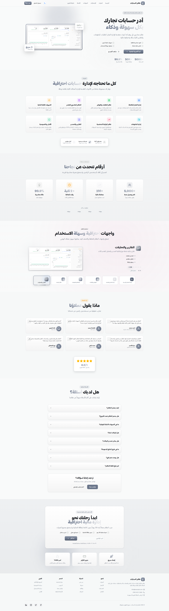
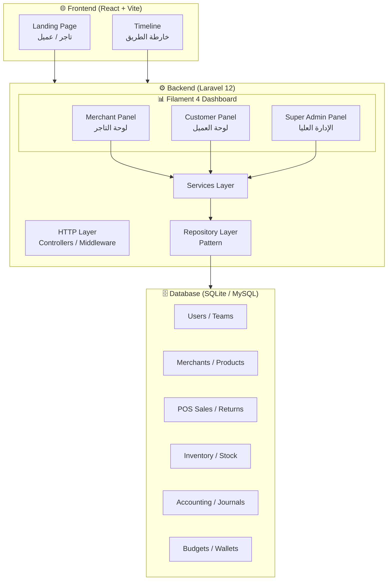
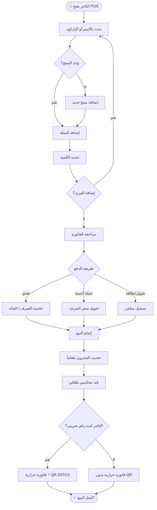
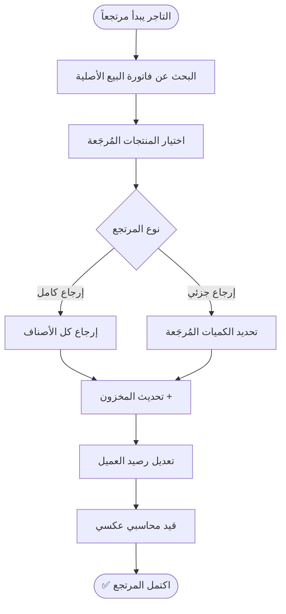
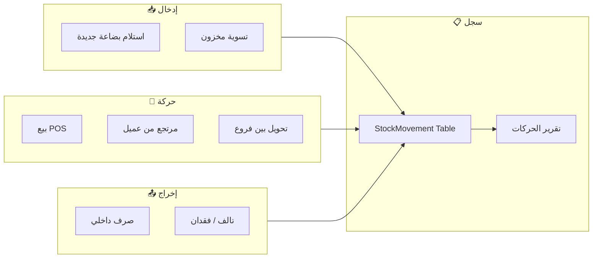
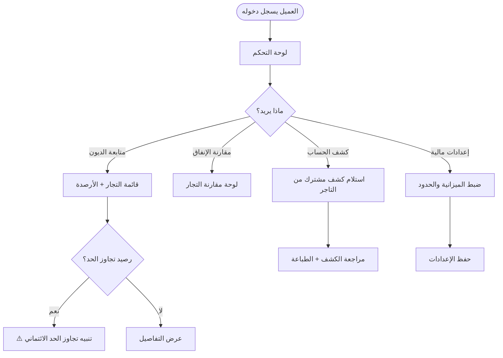
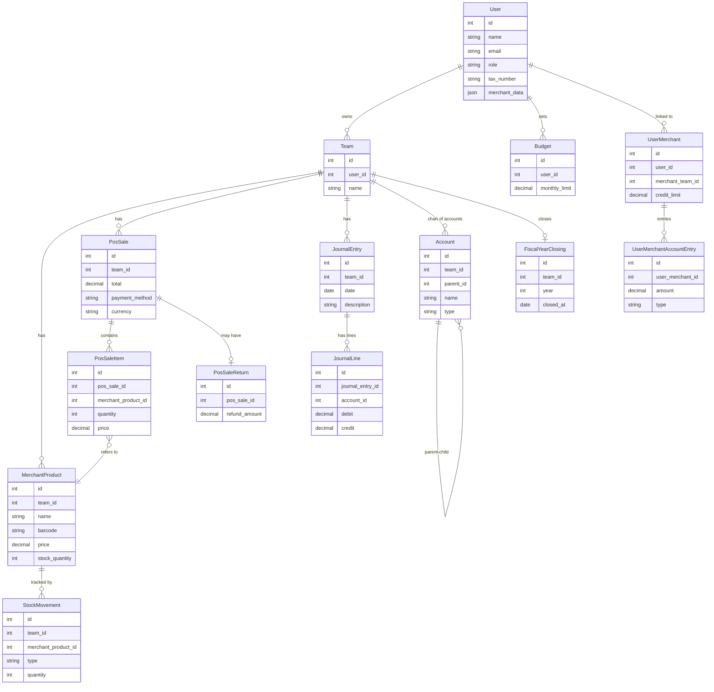
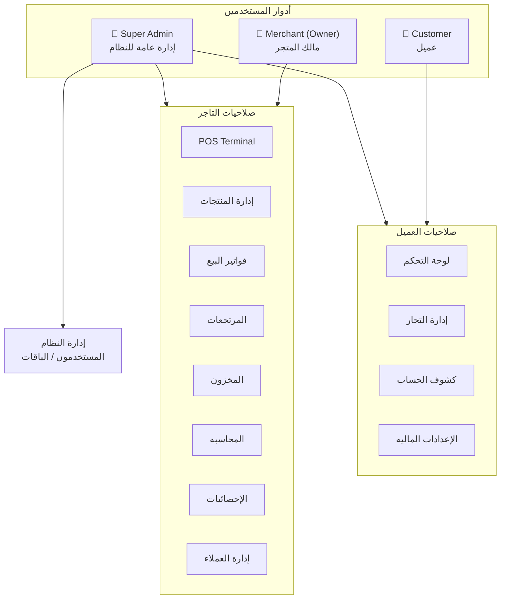

# 🛒 1.0.5 نظام إدارة حسابات التجار والعملاء




> **نظام رقمي متكامل** لإدارة حسابات التجار والعملاء، يُلغي الأخطاء اليدوية، يحفظ حقوق الطرفين، ويُقدّم تجربة محاسبية احترافية وشفافة.

---

## 💡 القصة وراء المشروع

بدأت الفكرة من تجربة واقعية:
صاحب بقالة سجّل بالخطأ عليّ مبلغ **12,000 ريال** لمعاملة تخص شخصًا آخر.
ومن هنا جاءت الفكرة:

> كم من الأخطاء تُرتكب يوميًا بسبب التسجيل اليدوي؟ وكم من الخلافات تحدث لغياب النظام والشفافية؟

🎯 **الحل:** بناء نظام رقمي متكامل يخدم التاجر والعميل معاً — يمنع الأخطاء، يحفظ الحقوق، ويُقدّم تجربة احترافية وسهلة.

---

## 🧩 الوحدات الوظيفية الحالية (Live Modules)

النظام يحتوي حالياً على **وحدتين رئيسيتين** تخدمان نوعَي المستخدم:

### 🏪 وحدة التاجر (Merchant Panel)

| الوحدة | الوصف |
|---|---|
| **نقطة البيع POS** | واجهة كاشير سريعة بالباركود، مسح الكاميرا، حاسبة الصرف الأجنبي |
| **المنتجات والمخزون** | كتالوج منتجات، تتبع المخزون، ملصقات الباركود الحرارية |
| **فواتير البيع** | فاتورة حرارية 58/80mm، QR Code وفق ZATCA المرحلة الأولى |
| **المرتجعات** | إرجاع واستبدال جزئي/كلي مع تحديث المخزون تلقائياً |
| **حركات المخزون** | سجل تفصيلي لكل إدخال وإخراج وتسوية |
| **شجرة الحسابات** | دليل حسابات هرمي قابل للتخصيص |
| **القيود اليومية** | قيود يدوية وتلقائية، كشف الحساب، ميزان المراجعة |
| **الإغلاق المحاسبي السنوي** | إغلاق السنة المالية ونقل الأرصدة الختامية تلقائياً |
| **لوحة الإحصائيات** | رسوم بيانية تفاعلية، مقارنة الفترات، تصدير التقارير |
| **إدارة التجار والعملاء** | بيانات التاجر، الحدود الائتمانية، الموزعين، الموردين |
| **إدارة بيانات التاجر** | الشعار، الرقم الضريبي، إعدادات الفروع |
| **الميزانية والفئات** | تخطيط الميزانية وتصنيف المصروفات |

### 👤 وحدة العميل (Customer Panel)

| الوحدة | الوصف |
|---|---|
| **لوحة التحكم** | ملخص مالي شامل بأرصدة ومديونيات جميع التجار |
| **إدارة التجار** | قائمة التجار مع الرصيد والمديونية وآخر عملية |
| **لوحة مقارنة التجار** | مقارنة بصرية للإنفاق بين التجار |
| **كشوف الحساب المشتركة** | استلام كشف الحساب مباشرة من التاجر |
| **إدارة الإعدادات المالية** | الميزانية الشخصية، الحدود الائتمانية |
| **البيانات الشخصية** | تصدير واستيراد البيانات، إدارة الحساب |

---

## 🗺️ هيكل النظام (System Architecture)


```mermaid
graph TB
    subgraph FE["🌐 Frontend (React + Vite)"]
        LP["Landing Page\nتاجر / عميل"]
        TL["Timeline\nخارطة الطريق"]
    end

    subgraph BE["⚙️ Backend (Laravel 12)"]
        direction TB
        subgraph Filament["📊 Filament 4 Dashboard"]
            MP["Merchant Panel\nلوحة التاجر"]
            CP["Customer Panel\nلوحة العميل"]
            SA["Super Admin Panel\nالإدارة العليا"]
        end
        HTTP["HTTP Layer\nControllers / Middleware"]
        SVC["Services Layer"]
        REPO["Repository Layer\nPattern"]
    end

    subgraph DB["🗄️ Database (SQLite / MySQL)"]
        direction LR
        M1["Users / Teams"]
        M2["Merchants / Products"]
        M3["POS Sales / Returns"]
        M4["Inventory / Stock"]
        M5["Accounting / Journals"]
        M6["Budgets / Wallets"]
    end

    LP --> BE
    TL --> BE
    MP --> SVC
    CP --> SVC
    SA --> SVC
    SVC --> REPO
    REPO --> DB
```

---

## 🔄 مسار البيع في نقطة البيع (POS Flow)


```mermaid
flowchart TD
    A([🏪 التاجر يفتح POS]) --> B[بحث بالاسم أو الباركود]
    B --> C{وُجد المنتج؟}
    C -- لا --> D[إضافة منتج جديد]
    C -- نعم --> E[إضافة للسلة]
    D --> E
    E --> F[تحديد الكمية]
    F --> G{إضافة المزيد؟}
    G -- نعم --> B
    G -- لا --> H[مراجعة الفاتورة]
    H --> I{طريقة الدفع}
    I -- نقدي --> J[حاسبة الصرف / الفكة]
    I -- عملة أجنبية --> K[تحويل سعر الصرف]
    I -- تحويل/بطاقة --> L[تسجيل مباشر]
    J --> M[إتمام البيع]
    K --> M
    L --> M
    M --> N[تحديث المخزون تلقائياً]
    N --> O[قيد محاسبي تلقائي]
    O --> P{التاجر لديه رقم ضريبي؟}
    P -- نعم --> Q[فاتورة حرارية + QR ZATCA]
    P -- لا --> R[فاتورة حرارية بدون QR]
    Q --> S([✅ اكتمل البيع])
    R --> S
```

---

## 🔁 مسار المرتجع (Return Flow)


```mermaid
flowchart TD
    A([التاجر يبدأ مرتجعاً]) --> B[البحث عن فاتورة البيع الأصلية]
    B --> C[اختيار المنتجات المُرجَعة]
    C --> D{نوع المرتجع}
    D -- إرجاع كامل --> E[إرجاع كل الأصناف]
    D -- إرجاع جزئي --> F[تحديد الكميات المُرجَعة]
    E --> G[تحديث المخزون +]
    F --> G
    G --> H[تعديل رصيد العميل]
    H --> I[قيد محاسبي عكسي]
    I --> J([✅ اكتمل المرتجع])
```

---

## 📦 مسار إدارة المخزون (Inventory Flow)


```mermaid
flowchart LR
    subgraph IN["📥 إدخال"]
        A1[استلام بضاعة جديدة]
        A2[تسوية مخزون]
    end

    subgraph MOVE["🔄 حركة"]
        B1[بيع POS]
        B2[مرتجع من عميل]
        B3[تحويل بين فروع]
    end

    subgraph OUT["📤 إخراج"]
        C1[صرف داخلي]
        C2[تالف / فقدان]
    end

    subgraph LOG["📋 سجل"]
        D1[StockMovement Table]
        D2[تقرير الحركات]
    end

    IN --> D1
    MOVE --> D1
    OUT --> D1
    D1 --> D2
```

---

## 👤 مسار العميل (Customer Flow)


```mermaid
flowchart TD
    A([العميل يسجل دخوله]) --> B[لوحة التحكم]
    B --> C{ماذا يريد؟}
    C -- متابعة الديون --> D[قائمة التجار + الأرصدة]
    C -- مقارنة الإنفاق --> E[لوحة مقارنة التجار]
    C -- كشف الحساب --> F[استلام كشف مشترك من التاجر]
    C -- إعدادات مالية --> G[ضبط الميزانية والحدود]
    D --> H{رصيد تجاوز الحد؟}
    H -- نعم --> I[⚠️ تنبيه تجاوز الحد الائتماني]
    H -- لا --> J[عرض التفاصيل]
    F --> K[مراجعة الكشف + الطباعة]
    G --> L[حفظ الإعدادات]
```

---

## 🏗️ هيكل المجلدات (Project Structure)

```
shop/
├── app/
│   ├── Enums/                    # Enums (أنواع الحركات، طرق الدفع...)
│   ├── Exports/                  # Excel/JSON Exports
│   ├── Filament/
│   │   ├── Pages/                # الصفحات المخصصة
│   │   │   ├── PosTerminal.php   # ⭐ نقطة البيع الكاملة
│   │   │   ├── Dashboard.php
│   │   │   ├── MerchantStatisticsDashboard.php
│   │   │   ├── MerchantComparisonDashboard.php
│   │   │   ├── ManageMerchantData.php
│   │   │   ├── ManagePersonalData.php
│   │   │   ├── ManageFinancialSettings.php
│   │   │   ├── FiscalYearClosingPage.php
│   │   │   ├── FinancialReports.php
│   │   │   └── SharedCustomerStatements.php
│   │   ├── Resources/            # موارد CRUD (21 مورد)
│   │   │   ├── Accounts/
│   │   │   ├── MerchantProducts/
│   │   │   ├── PosSales/
│   │   │   ├── PosSaleReturns/
│   │   │   ├── StockMovements/
│   │   │   ├── InventoryCounts/
│   │   │   ├── JournalEntries/
│   │   │   ├── MerchantCustomers/
│   │   │   ├── Budgets/
│   │   │   ├── Suppliers/
│   │   │   ├── Distributors/
│   │   │   └── ...
│   │   ├── Schemas/              # Form Schemas المشتركة
│   │   └── Widgets/              # Widgets الإحصائية
│   ├── Models/                   # 33 نموذج Eloquent
│   ├── Repositories/             # Repository Pattern (9 repos)
│   ├── Services/                 # Business Logic Services
│   └── Helpers/                  # Helper Functions
├── resources/
│   ├── js/src/                   # React + Vite (Landing Page)
│   │   ├── components/landing/   # Hero, Features, Screenshots...
│   │   └── pages/                # Index, Timeline
│   └── views/filament/           # Blade Views (POS Receipt...)
├── database/
│   └── migrations/               # جداول قاعدة البيانات
└── public/
    ├── merchant/                 # صور واجهة التاجر
    └── customer/                 # صور واجهة العميل
```

---

## 🗄️ نموذج قاعدة البيانات (Data Model — Key Relations)


```mermaid
erDiagram
    User {
        int id
        string name
        string email
        string role
        string tax_number
        json merchant_data
    }
    Team {
        int id
        int user_id
        string name
    }
    MerchantProduct {
        int id
        int team_id
        string name
        string barcode
        decimal price
        int stock_quantity
    }
    PosSale {
        int id
        int team_id
        decimal total
        string payment_method
        string currency
    }
    PosSaleItem {
        int id
        int pos_sale_id
        int merchant_product_id
        int quantity
        decimal price
    }
    PosSaleReturn {
        int id
        int pos_sale_id
        decimal refund_amount
    }
    StockMovement {
        int id
        int team_id
        int merchant_product_id
        string type
        int quantity
    }
    JournalEntry {
        int id
        int team_id
        date date
        string description
    }
    JournalLine {
        int id
        int journal_entry_id
        int account_id
        decimal debit
        decimal credit
    }
    Account {
        int id
        int team_id
        int parent_id
        string name
        string type
    }
    FiscalYearClosing {
        int id
        int team_id
        int year
        date closed_at
    }
    Budget {
        int id
        int user_id
        decimal monthly_limit
    }
    UserMerchant {
        int id
        int user_id
        int merchant_team_id
        decimal credit_limit
    }
    UserMerchantAccountEntry {
        int id
        int user_merchant_id
        decimal amount
        string type
    }

    User ||--o{ Team : "owns"
    Team ||--o{ MerchantProduct : "has"
    Team ||--o{ PosSale : "has"
    PosSale ||--o{ PosSaleItem : "contains"
    PosSaleItem }o--|| MerchantProduct : "refers to"
    PosSale ||--o| PosSaleReturn : "may have"
    MerchantProduct ||--o{ StockMovement : "tracked by"
    Team ||--o{ JournalEntry : "has"
    JournalEntry ||--o{ JournalLine : "has lines"
    Team ||--o{ Account : "chart of accounts"
    Account ||--o{ Account : "parent-child"
    Team ||--o| FiscalYearClosing : "closes"
    User ||--o{ Budget : "sets"
    User ||--o{ UserMerchant : "linked to"
    UserMerchant ||--o{ UserMerchantAccountEntry : "entries"
```

---

## 🔐 نظام الأدوار والصلاحيات (Roles & Permissions)


```mermaid
flowchart TD
    subgraph Roles["أدوار المستخدمين"]
        SA["👑 Super Admin\nإدارة عامة للنظام"]
        M["🏪 Merchant (Owner)\nمالك المتجر"]
        C["👤 Customer\nعميل"]
    end

    subgraph MPerms["صلاحيات التاجر"]
        P1["POS Terminal"]
        P2["إدارة المنتجات"]
        P3["فواتير البيع"]
        P4["المرتجعات"]
        P5["المخزون"]
        P6["المحاسبة"]
        P7["الإحصائيات"]
        P8["إدارة العملاء"]
    end

    subgraph CPerms["صلاحيات العميل"]
        Q1["لوحة التحكم"]
        Q2["إدارة التجار"]
        Q3["كشوف الحساب"]
        Q4["الإعدادات المالية"]
    end

    SA --> MPerms
    SA --> CPerms
    SA --> SA_Only["إدارة النظام\nالمستخدمون / الباقات"]
    M --> MPerms
    C --> CPerms
```

---

## ⚙️ التقنيات المستخدمة

| التقنية | الإصدار | الاستخدام |
|---|---|---|
| **Laravel** | 13.x | الإطار الأساسي للـ Backend |
| **Filament** | 5.x | لوحات التحكم والـ CRUD |
| **Livewire** | 4.x | التفاعلية اللحظية في الـ POS |
| **Alpine.js** | 3.x | التفاعل على مستوى الـ UI |
| **React + Vite** | 19 / 10 | صفحة الهبوط والـ Landing Page |
| **Tailwind CSS** | 4.x | تصميم واجهات المستخدم |
| **SQLite / MySQL** | — | قاعدة البيانات |
| **QRious.js** | — | توليد QR Code للفواتير |
| **Repository Pattern** | — | تنظيم طبقة الوصول للبيانات |
| **Team Tenancy** | — | عزل بيانات كل تاجر |

---

## 📋 متطلبات التشغيل

- **PHP**: 8.4 أو أعلى
- **Composer**: آخر إصدار
- **Node.js**: 18 أو أعلى
- **NPM**: آخر إصدار

---

## 🚀 خطوات تشغيل المشروع

### 1️⃣ تحميل المشروع

```bash
git clone https://github.com/YacoubAl-hardari/shop.git
cd shop
```

### 2️⃣ تثبيت المكتبات

```bash
composer install
npm install
```

### 3️⃣ إعداد البيئة

```bash
cp .env.example .env
php artisan key:generate
```

**.env الأساسي:**

```env
APP_NAME="Merchant System"
APP_ENV=local
APP_DEBUG=true
APP_URL=http://shop.test

DB_CONNECTION=sqlite
QUEUE_CONNECTION=database
```

### 4️⃣ قاعدة البيانات

```bash
php artisan migrate
# أو مع بيانات تجريبية:
php artisan migrate --seed
```

### 5️⃣ بناء الـ Frontend

```bash
# وضع التطوير
npm run dev

# البناء للإنتاج
npm run build
```

### 6️⃣ تشغيل السيرفر

```bash
# باستخدام Herd أو:
php artisan serve
```

---

## 🔐 إنشاء حساب إداري

```bash
php artisan make:filament-user
```

سيُطلب منك: الاسم، البريد الإلكتروني، كلمة المرور.

---

## 🗺️ خارطة الطريق (Roadmap)

| الميزة | الحالة |
|---|---|
| نقطة البيع POS | ✅ متاح |
| إدارة المنتجات والمخزون | ✅ متاح |
| الفاتورة الحرارية + QR ZATCA المرحلة 1 | ✅ متاح |
| المرتجعات | ✅ متاح |
| النظام المحاسبي الكامل | ✅ متاح |
| بوابة العميل | ✅ متاح |
| الإغلاق المحاسبي السنوي | ✅ متاح |
| لوحة الإحصائيات | ✅ متاح |
| التكامل الرسمي مع ZATCA المرحلة 2 | 🔧 قيد التطوير |
| تطبيق الجوال (iOS / Android) | 🔜 قريباً |
| التقارير بالذكاء الاصطناعي | 🔜 قريباً |

---

## 🤝 المساهمة

المشروع مفتوح المصدر. المساهمات مرحّب بها عبر Pull Requests.
تأكد من اتباع معايير الكود واختبار تغييراتك قبل الإرسال.

---

## 📄 الترخيص

MIT License — حر الاستخدام مع الإشارة للمصدر.
